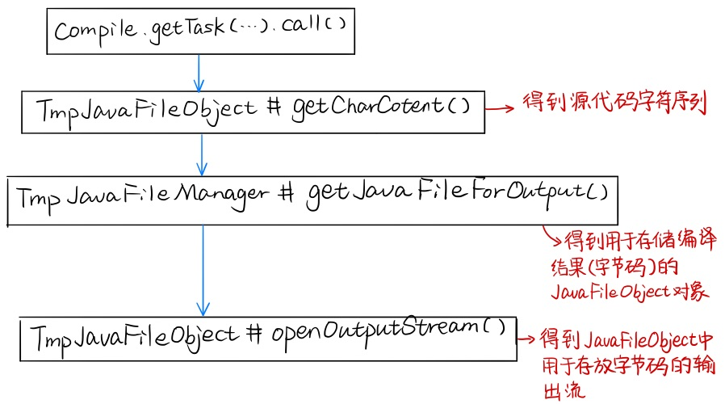

# 动态编译

<!-- TOC -->

- [动态编译](#%E5%8A%A8%E6%80%81%E7%BC%96%E8%AF%91)
  - [准备编译器](#%E5%87%86%E5%A4%87%E7%BC%96%E8%AF%91%E5%99%A8)
    - [`Iterable<? extends JavaFileObject> compilationUnits`](#iterable-extends-javafileobject-compilationunits)
    - [`JavaFileManager fileManager`](#javafilemanager-filemanager)
    - [`DiagnosticListener<? super JavaFileObject> diagnosticListener`](#diagnosticlistener-super-javafileobject-diagnosticlistener)
    - [`Iterable<String> options`](#iterablestring-options)
    - [`Writer out` & `Iterable<String> classes`](#writer-out--iterablestring-classes)
  - [实现编译器](#%E5%AE%9E%E7%8E%B0%E7%BC%96%E8%AF%91%E5%99%A8)

<!-- /TOC -->

从 JDK 1.6 开始，引入了 Java 代码重写的编译接口，使得我们可以在运行时编译 Java 代码，然后再通过类加载器将编译好的类加载进 JVM，这种在运行时编译代码的操作就叫做动态编译。

通过使用动态编译，可以将源代码的字符串直接编译为字节码，在没有动态编译之前，想要在运行过程中编译 Java 源代码，我们要先将源代码写入一个 .java 文件，通过 javac 编译这个文件，得到 .class 文件，然后将 .class 文件通过 ClassLoader 加载进内存，才能得到 Class 对象。这其中存在两个问题：一是会生成 .java 和 .class 两个文件，运行之后还要把它们删除，以防止污染我们的服务器环境；二是会生成文件也就是说涉及 IO 操作，这个操作比起一切都在内存中运行是十分耗时的。所以我们使用了 Java 的动态编译技术，跳过了这两个文件的生成过程，直接在内存中将源代码字符串编译为字节码的字节数组，这样既不会污染环境，又不会额外的引入 IO 操作，一举两得。


## 准备编译器

```java
JavaCompiler compiler = ToolProvider.getSystemJavaCompiler(); // 获取编译器对象
/* 准备执行编译需要的各种入参 */
Boolean result = compiler.getTask(null, manager, collector, options, 
                                  null, Arrays.asList(javaFileObject)).call(); // 执行编译
```

我们发现执行编译的那个函数有一大堆入参需要提前准备，所以我们需要先来看一下这些入参都是什么，以及该怎么准备，getTask() 方法的声明如下：

```java
JavaCompiler.CompilationTask getTask(Writer out,
                                     JavaFileManager fileManager,
                                     DiagnosticListener<? super JavaFileObject> diagnosticListener,
                                     Iterable<String> options,
                                     Iterable<String> classes,
                                     Iterable<? extends JavaFileObject> compilationUnits)
```

这个方法一共有 6 个入参，它们分别是：

- `out`：编译器的一个额外的输出 Writer，为 null 的话就是 System.err；
- `fileManager`：文件管理器；
- `diagnosticListener`：诊断信息收集器；
- `options`：编译器的配置；
- `classes`：需要被 annotation processing 处理的类的类名；
- `compilationUnits`：要被编译的单元们，就是一堆 JavaFileObject。

为了能成功的进行编译，我们要按照上面的入参需求，一个一个的构建这些参数对象。我们将按照重要程度来一个一个讲解。

> **Notes：** 我们将自己实现的 JavaFileObject 和 JavaFileManager 两个类都实现为了 StringSourceCompiler 的内部类，StringSourceCompiler 中有一个 `private static Map<String, JavaFileObject> fileObjectMap = new ConcurrentHashMap<>()` 属性用来存放编译好的字节码对象。

### `Iterable<? extends JavaFileObject> compilationUnits`

这个参数的重点在 `JavaFileObject` 上，是一个装着许多等着被编译的源代码的集合（这些源代码都被封装在了一个一个 `JavaFileObject` 对象中），Java 类库并没有给我们提供能直接使用的 `JavaFileObject`，所以我们要通过继承 `SimpleJavaFileObject` 来实现我们自己的 `JavaFileObject`。

为了知道我们都需要重写 `SimpleJavaFileObject` 的哪些方法，我们首先需要看一下 `compiler.getTask(...).call()` 的执行流程，看看都需要用到什么方法。 `compiler.getTask(...).call()` 的执行流程如下图所示：



**执行流程说明：**

- 首先，要得到源码才能进行编译，所以会调用 JavaFileObject 的 getCharContent 方法，得到源码的字符序 CharSequence；
- 然后，编译器会对得到的源码进行编译，得到字节码，并且会将得到的字节码封装进一个 JavaFileObject 对象；
- 编译器会把字节码结果存入一个 JavaFileObject 中，这个操作是需要创建一个 JavaFileObject 对象的，可是我们用来真实存储源码和字节码的 JavaFileObject 对象是我们自己写的，那么编译器如何得知它应该把编译生成的字节码放入一个怎样的 JavaFileObject 中呢?
- 这时就要轮到 JavaFileManager 出场了，编译器会调用我们传入的 JavaFileManager fileManager 的 getJavaFileForOutput 方法，这个方法会 new 一个我们写的 TmpJavaFileObject 对象，并把返回给编译器；
- 接下来，编译器会把生成的字节码放在 TmpJavaFileObject 对象中，存放的位置是由我们自己指定的，在 TmpJavaFileObject 中加入一个 ByteArrayOutputStream 属性用于存储字节码，编译器会通过 openOutputStream() 来创建输出流对象，并把这个用来存储字节的容器返回给编译器，让它把编译生成的字节码放进去；
- 最后，我们想要的是 byte[] 字节数组，而非一个输出流，只要再在 TmpJavaFileObject 中加入一个 getCompiledBytes() 方法将 ByteArrayOutputStream 中的内容变成 byte[] 返回即可。

所以，我们实现的 SimpleJavaFileObject 的子类如下：

```java
public static class TmpJavaFileObject extends SimpleJavaFileObject {
    private String source;
    private ByteArrayOutputStream outputStream;

    /**
     * 构造用来存储源代码的JavaFileObject
     * 需要传入源码source，然后调用父类的构造方法创建kind = Kind.SOURCE的JavaFileObject对象
     */
    public TmpJavaFileObject(String name, String source) {
        super(URI.create("String:///" + name + Kind.SOURCE.extension), Kind.SOURCE);
        this.source = source;
    }

    /**
	 * 构造用来存储字节码的JavaFileObject
	 * 需要传入kind，即我们想要构建一个存储什么类型文件的JavaFileObject
	 */
    public TmpJavaFileObject(String name, Kind kind) {
        super(URI.create("String:///" + name + Kind.SOURCE.extension), kind);
        this.source = null;
    }

    @Override
    public CharSequence getCharContent(boolean ignoreEncodingErrors) throws IOException {
        if (source == null) {
            throw new IllegalArgumentException("source == null");
        }
        return source;
    }

    @Override
    public OutputStream openOutputStream() throws IOException {
        outputStream = new ByteArrayOutputStream();
        return outputStream;
    }

    public byte[] getCompiledBytes() {
        return outputStream.toByteArray();
    }
}
```

### `JavaFileManager fileManager`

对于 JavaFileManager，我们需要重写以下 2 个方法：

```java
public static class TmpJavaFileManager extends ForwardingJavaFileManager<JavaFileManager> {
    protected TmpJavaFileManager(JavaFileManager fileManager) {
        super(fileManager);
    }

    @Override
    public JavaFileObject getJavaFileForInput(JavaFileManager.Location location, 
                                              String className, 
                                              JavaFileObject.Kind kind) throws IOException {
        JavaFileObject javaFileObject = fileObjectMap.get(className);
        if (javaFileObject == null) {
            return super.getJavaFileForInput(location, className, kind);
        }
        return javaFileObject;
    }

    @Override
    public JavaFileObject getJavaFileForOutput(JavaFileManager.Location location, 
                                               String className, 
                                               JavaFileObject.Kind kind, 
                                               FileObject sibling) throws IOException {
        JavaFileObject javaFileObject = new TmpJavaFileObject(className, kind);
        fileObjectMap.put(className, javaFileObject);
        return javaFileObject;
    }
}
```

### `DiagnosticListener<? super JavaFileObject> diagnosticListener`

直接 new 一个就可以，主要用来告诉我们编译是成功了还是失败了，以及警告信息之类的。

```java
DiagnosticCollector<JavaFileObject> collector = new DiagnosticCollector<>();
```

### `Iterable<String> options`

这个就是我们在使用 javac 命令时，可以添加的选项，比如编译目标，输出路径，类路径等，不需要的话可以传入 null。

```java
List<String> options = new ArrayList<>();
options.add("-target");
options.add("1.8");
options.add("-d");
options.add("/");
```

### `Writer out` & `Iterable<String> classes`

这两个传入 null 就行。


## 实现编译器

最后，我们的编译器实现如下，通过调用 `StringSourceCompiler.compile(String source)` 就可以得到字符串源代码 source 的编译结果。

```java
public class StringSourceCompiler {
    private static Map<String, JavaFileObject> fileObjectMap = new ConcurrentHashMap<>();

    public static byte[] compile(String source) {
        JavaCompiler compiler = ToolProvider.getSystemJavaCompiler();
        DiagnosticCollector<JavaFileObject> collector = new DiagnosticCollector<>();
        JavaFileManager javaFileManager =
                new TmpJavaFileManager(compiler.getStandardFileManager(collector, null, null));

        // 从源码字符串中匹配类名
        Pattern CLASS_PATTERN = Pattern.compile("class\\s+([$_a-zA-Z][$_a-zA-Z0-9]*)\\s*");
        Matcher matcher = CLASS_PATTERN.matcher(source);
        String className;
        if (matcher.find()) {
            className = matcher.group(1);
        } else {
            throw new IllegalArgumentException("No valid class");
        }

        // 把源码字符串构造成JavaFileObject，供编译使用
        JavaFileObject sourceJavaFileObject = new TmpJavaFileObject(className, source);

        Boolean result = compiler.getTask(null, javaFileManager, collector,
                null, null, Arrays.asList(sourceJavaFileObject)).call();

        JavaFileObject bytesJavaFileObject = fileObjectMap.get(className);
        if (result && bytesJavaFileObject != null) {
            return ((TmpJavaFileObject) bytesJavaFileObject).getCompiledBytes();
        }
        return null;
    }

    /**
     * 管理JavaFileObject对象的工具
     */
    public static class TmpJavaFileManager extends ForwardingJavaFileManager<JavaFileManager> {
		// ...
    }

    /**
     * 用来封装表示源码与字节码的对象
     */
    public static class TmpJavaFileObject extends SimpleJavaFileObject {
		// ...
    }
}
```

